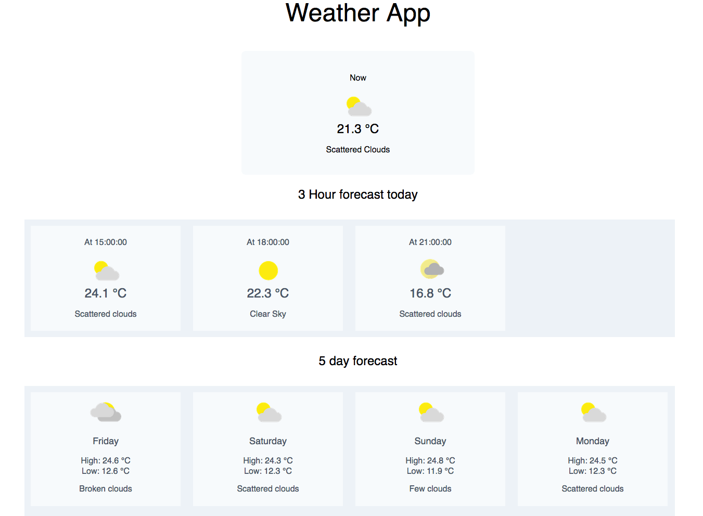

### Weather Application

## Technologies used

- React
- MobX
- Tailwind css

## Weather information from [Rapid API](https://rapidapi.com/weatherbit/api/weather/details)

## See it in action

- clone / download repo
- npm install
- npm start - The application will start on http://localhost:3000

The browser will ask to use your location. Click Allow depending on your browser request.

Example Image

